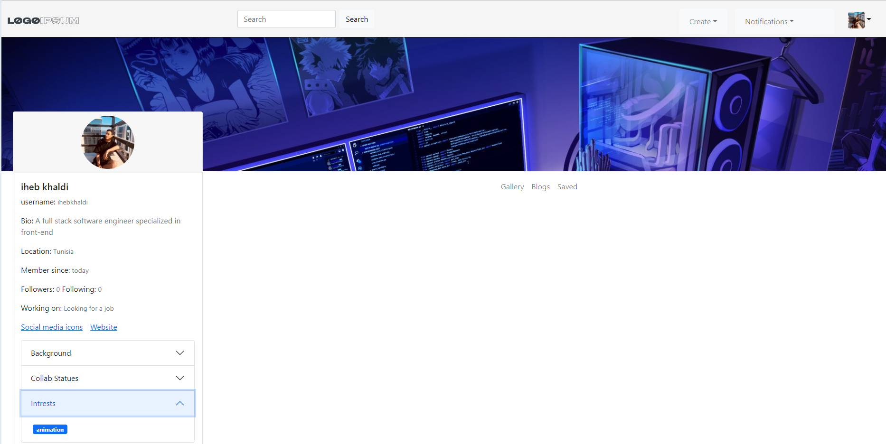
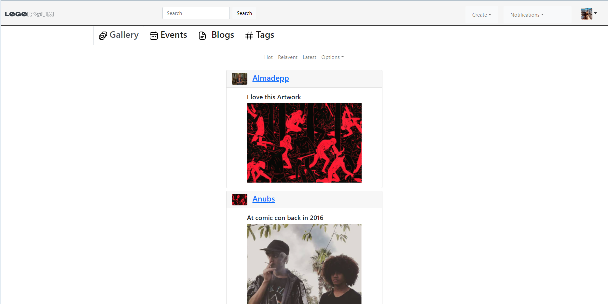
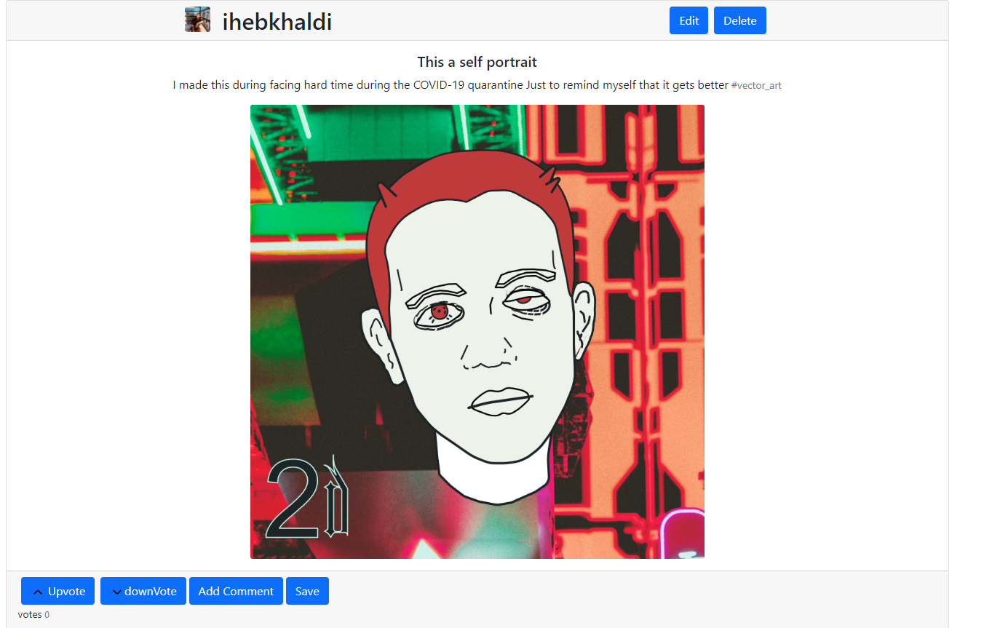
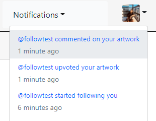

# Blossom
## this is a Beta version

[](https://travis-ci.org/joemccann/dillinger)

Blossom is a constructive and inclusive social network that links artists to each other.

- Share artworks
- Ask questions
- Write blogs
- Organize events
- serves the purpose of a portfolio
- ✨  Do your Magic ✨

## Screenshots





## Features

- Select topics to follow as tags
- Get the most recent news you're following in your homepage
- Create, Delete and Save Blogs, Artworks and Events 
- Follow other artists
- Comment on other artists Artworks, Blogs
- Search and find other artists by either fullname or username 


## Tech

Blossom uses a number of open source technolgies to work properly:

- [ReactJS] - It simplifies the entire method of writing components in high-volume applications.
- [Webpack] - configure control over how to treat different assets it encounters.
- [React Router] 
- [React Bootstrap] - great UI boilerplate for modern web apps
- [Redux] - store and share data with multiple components
- [Figma] - Was used to create a proper Sitemap, wireframe, Basic UI

And of course Blossom itself is open source with a [public repository][dill]
 on GitHub.

## Installation

Blossom requires [Npm](https://www.npmjs.com) v8.5.5+ to run.

Install the dependencies and devDependencies and start the server.

```sh
cd blossoom-frontend
npm install
npm run start
```

To Build ...

```sh
npm run build
```
## Improvements

- Adding user authentication using social media
- Making a Better and clean user interface
- Adding some security and validation layers to the app


## Development

Contribution will be soon available in more details 


## License

MIT

**Free Software, Hell Yeah!**
